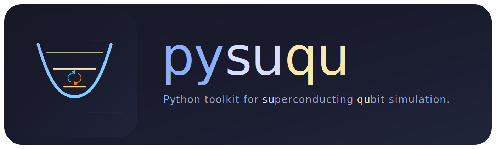

<div align="center">
  

  <h1>pysuqu</h1>
  <p><strong>Python toolkit for superconducting qubit simulation.</strong></p>
  <p>
    <a href="#english">English</a> |
    <a href="#zh-cn">简体中文</a>
  </p>
  <p>
    
    
    
    
  </p>
</div>

<a id="english"></a>

## English

`pysuqu` is the public package-first distribution of the `pysuqu` 2.0 codebase.
This repository starts directly at version `2.0.0` and intentionally publishes
the reusable library, public documentation, public tests, and public-safe demo
notebooks only.

| Public package | Reproducible demos | Public-safe scope |
| --- | --- | --- |
| `pysuqu/` exports the main simulation toolkit | `demo/` contains fresh notebooks with synthetic data only | private legacy notebooks and exploratory materials stay out of this repo |

### Highlights

- Superconducting qubit modeling utilities under `pysuqu.qubit`
- Decoherence and noise-analysis workflows under `pysuqu.decoherence`
- Public demo notebooks covering qubits, decoherence, waveforms, and coupler workflows
- Public tests, benchmark harnesses, and packaging metadata prepared for the public `2.0.1` release

### Installation

```bash
pip install -r requirements.txt
pip install -e .
```

To build distributable artifacts locally:

```bash
python -m build
```

### Quick Start

```python
import numpy as np

from pysuqu.qubit import AbstractQubit
from pysuqu.decoherence import ZNoiseDecoherence

qubit = AbstractQubit(
    frequency=5e9,
    anharmonicity=-250e6,
    frequency_max=6e9,
    qubit_type="Transmon",
    energy_trunc_level=12,
)

energies = qubit.get_energylevel()
print(f"f01 = {energies[1] / 2 / np.pi:.3e} Hz")

psd_freq = np.logspace(4, 8, 4000)
psd_s = 5e-16 / psd_freq + 4e-21

result = ZNoiseDecoherence(
    psd_freq=psd_freq,
    psd_S=psd_s,
    qubit_freq=5e9,
    qubit_anharm=-250e6,
).cal_tphi2(method="cal", idle_freq=5e9, is_print=False)

print(result.value, result.unit)
```

### Documentation

- [docs/README.md](docs/README.md)
- [docs/guides/getting-started.md](docs/guides/getting-started.md)
- [docs/architecture/module-map.md](docs/architecture/module-map.md)
- [docs/architecture/refactor-status.md](docs/architecture/refactor-status.md)
- [docs/guides/code-style.md](docs/guides/code-style.md)
- [demo/README.md](demo/README.md)

### Public Demo Notebooks

- [demo/demo_01_single_qubit_basics.ipynb](demo/demo_01_single_qubit_basics.ipynb)
- [demo/demo_02_decoherence_with_synthetic_noise.ipynb](demo/demo_02_decoherence_with_synthetic_noise.ipynb)
- [demo/demo_03_waveform_and_gate_basics.ipynb](demo/demo_03_waveform_and_gate_basics.ipynb)
- [demo/demo_04_multiqubit_coupler_workflow.ipynb](demo/demo_04_multiqubit_coupler_workflow.ipynb)

### Repository Layout

```text
pysuqu/
  pysuqu/        package source
  tests/          public test suite
  docs/           public documentation
  demo/           public tutorial notebooks and synthetic demo data
  benchmarks/     local performance benchmark harnesses
  requirements.txt
  setup.py
  pyproject.toml
  LICENSE
```

### License

This repository is licensed under the
[GNU Affero General Public License v3.0 or later](LICENSE).

If `pysuqu` is helpful to your work, you are very welcome to watch the
repository, fork it, and contribute improvements.


<a id="zh-cn"></a>

## 简体中文

`pysuqu` 是 `pysuqu` 2.0 的公开、以 Python 包为中心的发布仓库。这个仓库从
`2.0.0` 版本直接开始，对外只公开可复用的库代码、公开文档、公开测试，以及
使用公开安全合成数据重写后的 demo notebook。

| 公开包主体 | 可复现实例 | 公开范围控制 |
| --- | --- | --- |
| `pysuqu/` 提供核心模拟能力 | `demo/` 提供新的公开 notebook 与合成数据 | 旧私有 notebook 与探索性材料不会进入本仓库 |

### 主要内容

- `pysuqu.qubit` 中的超导量子比特建模能力
- `pysuqu.decoherence` 中的退相干与噪声分析工作流
- 覆盖单比特、退相干、波形门操作、多比特 coupler 工作流的公开 demo
- 为公开 `2.0.1` 版本整理好的测试、benchmark harness 与发布元数据

### 安装

```bash
pip install -r requirements.txt
pip install -e .
```

如需本地验证构建产物：

```bash
python -m build
```

### 快速开始

```python
import numpy as np

from pysuqu.qubit import AbstractQubit
from pysuqu.decoherence import ZNoiseDecoherence

qubit = AbstractQubit(
    frequency=5e9,
    anharmonicity=-250e6,
    frequency_max=6e9,
    qubit_type="Transmon",
    energy_trunc_level=12,
)

energies = qubit.get_energylevel()
print(f"f01 = {energies[1] / 2 / np.pi:.3e} Hz")

psd_freq = np.logspace(4, 8, 4000)
psd_s = 5e-16 / psd_freq + 4e-21

result = ZNoiseDecoherence(
    psd_freq=psd_freq,
    psd_S=psd_s,
    qubit_freq=5e9,
    qubit_anharm=-250e6,
).cal_tphi2(method="cal", idle_freq=5e9, is_print=False)

print(result.value, result.unit)
```

### 文档入口

- [docs/README.md](docs/README.md)
- [docs/guides/getting-started.md](docs/guides/getting-started.md)
- [docs/architecture/module-map.md](docs/architecture/module-map.md)
- [docs/architecture/refactor-status.md](docs/architecture/refactor-status.md)
- [docs/guides/code-style.md](docs/guides/code-style.md)
- [demo/README.md](demo/README.md)

### 公开 Demo

- [demo/demo_01_single_qubit_basics.ipynb](demo/demo_01_single_qubit_basics.ipynb)
- [demo/demo_02_decoherence_with_synthetic_noise.ipynb](demo/demo_02_decoherence_with_synthetic_noise.ipynb)
- [demo/demo_03_waveform_and_gate_basics.ipynb](demo/demo_03_waveform_and_gate_basics.ipynb)
- [demo/demo_04_multiqubit_coupler_workflow.ipynb](demo/demo_04_multiqubit_coupler_workflow.ipynb)

### 仓库结构

```text
pysuqu/
  pysuqu/        包源码
  tests/          公开测试
  docs/           公开文档
  demo/           公开 notebook 与合成 demo 数据
  requirements.txt
  setup.py
  pyproject.toml
  LICENSE
```

### 许可证

本仓库采用 [GNU Affero General Public License v3.0 或更高版本](LICENSE)。

如果 `pysuqu` 对你的工作有帮助，也非常欢迎你关注仓库、fork 项目并提交贡献。

